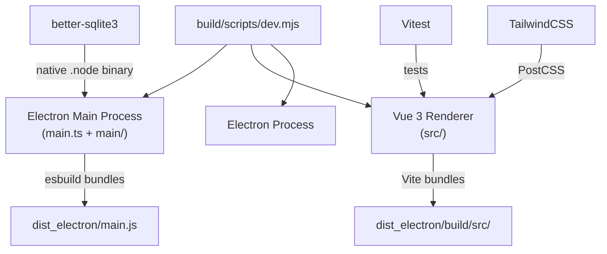

# 📁 Auditbooks — Project Structure Map

> **Stack**: Electron 22 · Vue 3 · Vite 5 · TypeScript 5 · TailwindCSS 3 · better-sqlite3 · Pinia · Vitest 2

---

## Root Directory

```
books - Copy/
├── 📄 package.json              # NPM manifest, scripts, deps, devDeps
├── 📄 vite.config.ts            # Vite config for RENDERER (dev-mode HMR only)
├── 📄 vitest.config.ts          # Vitest unit test configuration
├── 📄 tsconfig.json             # TypeScript compiler options (entire monorepo)
├── 📄 tailwind.config.js        # TailwindCSS v3 theme (CJS, reads colors.json)
├── 📄 postcss.config.js         # PostCSS: tailwindcss + autoprefixer
├── 📄 electron-builder-config.mjs  # electron-builder packaging config (ESM)
├── 📄 main.ts                   # Electron MAIN process entry point (esbuild)
├── 📄 colors.json               # Custom color palette loaded into Tailwind
├── 📄 .eslintrc.js              # ESLint config (vue-eslint-parser + TS-ESLint)
├── 📄 .prettierignore           # Prettier ignore patterns
├── 📄 .gitignore
├── 📄 yarn.lock                 # Yarn v1 lockfile
└── 📄 modernization_plan.md    # Existing notes (pre-existing)
```

---

## `src/` — Renderer Process (Vue 3 App)

```
src/
├── 📄 index.html               # Vite entry HTML (root for vite dev server)
├── 📄 renderer.ts              # Renderer bootstrap: createApp(), mounts to <body>
├── 📄 App.vue                  # Root component (Options API, NOT Composition API)
├── 📄 router.ts                # vue-router 4 route definitions
├── 📄 initFyo.ts               # Singleton Fyo instance (injected everywhere)
├── 📄 errorHandling.ts         # Global error handler + dialog helpers
├── 📄 importer.ts              # Data import utilities
├── 📄 shims-vue.d.ts           # TypeScript shim for .vue files
├── 📄 shims-vue-custom.d.ts    # Additional Vue TS shims
├── 📄 shims-tsx.d.ts           # TSX shims
│
├── 📁 assets/                  # Static assets (images, fonts)
├── 📁 components/              # Shared UI components (ESLint partially ignored!)
├── 📁 composables/             # Vue 3 composables (hooks)
├── 📁 pages/                   # Route-level page components
│   ├── DatabaseSelector.vue
│   ├── Desk.vue
│   └── SetupWizard/
│       └── SetupWizard.vue
├── 📁 setup/                   # Setup wizard logic & types
├── 📁 styles/                  # Global CSS (index.css imports Tailwind)
├── 📁 renderer/                # Renderer-specific helpers & IPC listeners
├── 📁 regional/                # Regional/localization renderer utils
├── 📁 stores/                  # ⚠️ EMPTY — Pinia stores directory is EMPTY
└── 📁 utils/                   # Renderer utility functions
    ├── db.ts
    ├── interactive.ts
    ├── language.ts
    ├── misc.ts
    ├── refs.ts
    ├── search.ts
    ├── shortcuts.ts
    ├── theme.ts
    ├── ui.ts
    └── vueUtils.ts
```

> ⚠️ `src/stores/` is **completely empty** — Pinia is in `package.json` as a dep, but no store files exist.

---

## `src/tests/` — Unit Tests

```
src/tests/
└── 📁 stores/
    └── 📄 app.spec.ts          # Only test file found (tests Pinia app store)
```

> ⚠️ `vitest.config.ts` references `src/tests/setup.ts` as a setup file — **this file does NOT exist**.

---

## `main/` — Electron Main Process Helpers

```
main/
├── 📄 api.ts
├── 📄 contactMothership.ts
├── 📄 getLanguageMap.ts
├── 📄 getPrintTemplates.ts
├── 📄 helpers.ts
├── 📄 initScheduler.ts
├── 📄 preload.ts               # Electron preload script (exposes ipc to renderer)
├── 📄 printHtmlDocument.ts
├── 📄 registerAppLifecycleListeners.ts
├── 📄 registerAutoUpdaterListeners.ts
├── 📄 registerIpcMainActionListeners.ts
├── 📄 registerIpcMainMessageListeners.ts
├── 📄 registerProcessListeners.ts
└── 📄 saveHtmlAsPdf.ts
```

---

## `build/` — Build Infrastructure

```
build/
├── 📄 entitlements.mac.plist   # macOS hardened runtime entitlements
├── 📄 icon.icns / icon.ico / icon.png
├── 📄 installerIcon.ico / uninstallerIcon.ico
├── 📁 icons/                   # Linux icon sizes
└── 📁 scripts/
    ├── 📄 dev.mjs              # Dev orchestrator: starts Vite + esbuild watcher + Electron
    ├── 📄 build.mjs            # Production builder: esbuild + Vite build + electron-builder
    └── 📄 helpers.mjs          # Shared esbuild config for main process
```

---

## `backend/` — SQLite / Database Layer

```
backend/
├── Database files using better-sqlite3
└── Accessed only by main process (not renderer directly)
```

---

## `fyo/` — Core Framework Layer

```
fyo/
├── Core application framework (ORM-like layer, telemetry, config, etc.)
└── Used by both renderer and main process via path aliases
```

---

## `models/` — Data Models

```
models/
├── Business logic models (AccountingSettings, ERPNextSyncSettings, etc.)
└── Shared between renderer and main process
```

---

## `schemas/` — JSON Schemas

```
schemas/
└── DocType schema definitions (used at runtime by fyo)
```

---

## `utils/` — Shared Utilities

```
utils/
└── Shared between renderer and main process (messages, types, etc.)
```

---

## `tests/` — Root-Level Tests

```
tests/
└── (contains test files accessible via 'tests' alias in vitest.config.ts)
```

---

## `scripts/` — Shell Scripts

```
scripts/
├── publish-mac-arm.sh
├── profile.sh
├── runner.sh
└── generateTranslations.ts
```

---

## `dist_electron/` — Build Output (Generated)

```
dist_electron/
├── dev/           # Dev mode esbuild output (main.js)
└── build/         # Production build output
    ├── main.js    # Bundled main process
    ├── src/       # Vite renderer build output
    └── ...
```

---

## Key Technology Relationships



---

## Path Aliases (Defined in vite.config.ts + vitest.config.ts + tsconfig.json)

| Alias      | Resolves To               |
| ---------- | ------------------------- |
| `src`      | `./src`                   |
| `fyo`      | `./fyo`                   |
| `schemas`  | `./schemas`               |
| `backend`  | `./backend`               |
| `models`   | `./models`                |
| `utils`    | `./utils`                 |
| `regional` | `./regional`              |
| `reports`  | `./reports`               |
| `dummy`    | `./dummy`                 |
| `fixtures` | `./fixtures`              |
| `tests`    | `./tests` _(vitest only)_ |

> ⚠️ **`fyo` alias is missing from `tsconfig.json` paths** — TypeScript will not resolve `fyo/*` imports at type-check time.
