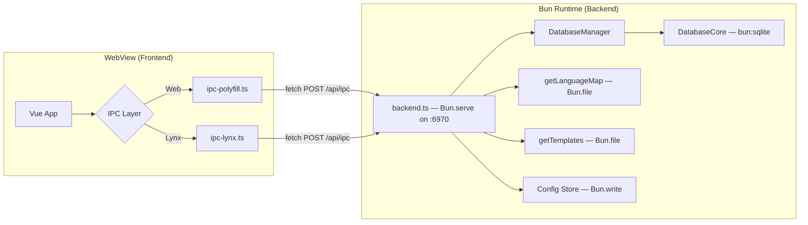

# Bun → Tauri Android Migration Audit & Implementation Plan

> Full audit of every Bun API call in the codebase, architecture tree, and a **module-by-module** migration strategy for running Auditbooks in Tauri's Android WebView.

---

## 1. Bun API Usage Report

Every `Bun.*` and `bun:*` API call found in the codebase, grouped by module.

### 1.1 Backend Server — [backend.ts](file:///e:/code/auditbooks/build/scripts/backend.ts)

This is the **heart of the Bun dependency**. It runs the dev HTTP backend on port 6970.

| Line         | Bun API                                      | Purpose                 | Tauri Replacement                            |
| ------------ | -------------------------------------------- | ----------------------- | -------------------------------------------- |
| L12          | `Bun.serve()`                                | HTTP server for IPC     | Tauri IPC commands (`#[tauri::command]`)     |
| L45          | `Bun.write(destPath, arrayBuffer)`           | Write uploaded DB file  | `std::fs::write()` in Rust                   |
| L139         | `Bun.file(filePath).exists()`                | Check if DB file exists | `std::path::Path::exists()` in Rust          |
| L146         | `Bun.write(savePath, data)`                  | Save arbitrary data     | `std::fs::write()` in Rust                   |
| L169         | `Bun.file(fullPath).text()`                  | Read doc file as text   | `std::fs::read_to_string()` in Rust          |
| L178         | `Bun.file(fullPath).arrayBuffer()`           | Read doc file as binary | `std::fs::read()` + base64 encode in Rust    |
| L214         | `new Bun.Glob("*.db")`                       | List DB files           | `std::fs::read_dir()` + filter in Rust       |
| L220         | `Bun.file(filePath).size` / `.lastModified`  | File metadata           | `std::fs::metadata()` in Rust                |
| L244         | `new Bun.Glob("*.db")`                       | Find first DB file      | Same as above                                |
| L285,301,320 | `Bun.file(configPath).exists()` / `.json()`  | Read config.json        | `std::fs::read_to_string()` + `serde_json`   |
| L311,330     | `Bun.write(configPath, JSON.stringify(...))` | Write config.json       | `std::fs::write()` in Rust                   |
| L340         | `import("playwright")`                       | HTML→PDF via Chromium   | Tauri plugin or WebView-based PDF (see §4.5) |

### 1.2 Database Core — [core.ts](file:///e:/code/auditbooks/backend/database/core.ts)

| Line | Bun API                                 | Purpose             | Tauri Replacement                                      |
| ---- | --------------------------------------- | ------------------- | ------------------------------------------------------ |
| L2   | `import { Database } from "bun:sqlite"` | SQLite driver       | `tauri-plugin-sql` (uses `rusqlite`)                   |
| L3   | `drizzle-orm/bun-sqlite`                | Drizzle ORM adapter | Drop Drizzle on mobile; use raw SQL via Tauri commands |

### 1.3 Drizzle Client — [client.ts](file:///e:/code/auditbooks/drizzle/db/client.ts)

| Line | Bun API                                 | Purpose                   | Tauri Replacement                       |
| ---- | --------------------------------------- | ------------------------- | --------------------------------------- |
| L1-2 | `drizzle-orm/bun-sqlite` + `bun:sqlite` | Standalone Drizzle client | Not needed on mobile (dev tooling only) |

### 1.4 Backend Shims — Language & Templates

#### [getLanguageMap.ts](file:///e:/code/auditbooks/backend/shims/getLanguageMap.ts)

| Line | Bun API                         | Purpose                       | Tauri Replacement                 |
| ---- | ------------------------------- | ----------------------------- | --------------------------------- |
| L56  | `Bun.file(filePath).text()`     | Read CSV translation file     | Tauri `fs` plugin or Rust command |
| L135 | `Bun.file(filePath).exists()`   | Check translation file exists | Tauri Rust command                |
| L150 | `Bun.file(filePath).exists()`   | Fallback path check           | Tauri Rust command                |
| L170 | `Bun.write(filePath, contents)` | Cache translation file        | Tauri Rust command                |

#### [getTemplates.ts](file:///e:/code/auditbooks/backend/shims/getTemplates.ts)

| Line | Bun API                           | Purpose                    | Tauri Replacement     |
| ---- | --------------------------------- | -------------------------- | --------------------- |
| L14  | `Bun.file(filePath).text()`       | Read print template        | Tauri Rust command    |
| L16  | `Bun.file(filePath).lastModified` | Template modification date | `std::fs::metadata()` |

### 1.5 Scratch/Utility Scripts (Non-production)

| File                                                                                    | Bun API                      | Notes                             |
| --------------------------------------------------------------------------------------- | ---------------------------- | --------------------------------- |
| [fix-type-declares.ts](file:///e:/code/auditbooks/scratch/fix-type-declares.ts)         | `Bun.Glob`                   | Dev utility — no migration needed |
| [add-declare-to-models.ts](file:///e:/code/auditbooks/scratch/add-declare-to-models.ts) | `Bun.Glob`                   | Dev utility — no migration needed |
| [fix-declare.ts](file:///e:/code/auditbooks/scratch/fix-declare.ts)                     | `import { glob } from "bun"` | Dev utility — no migration needed |

---

## 2. Architecture Tree View

```
auditbooks/
├── 🌐 FRONTEND (Runs in WebView)
│   ├── src/
│   │   ├── renderer.ts              ← Web entry (Vite + ipc-polyfill)
│   │   ├── renderer-lynx.ts         ← Lynx native entry (rspeedy + ipc-lynx)
│   │   ├── ipc-polyfill.ts          ← Web IPC: fetch() → Bun HTTP backend
│   │   ├── ipc-lynx.ts              ← Lynx IPC: fetch() → Bun HTTP backend
│   │   ├── initFyo.ts               ← Web Fyo init (uses ipc-polyfill)
│   │   ├── initFyo-lynx.ts          ← Lynx Fyo init (uses LynxDemux)
│   │   ├── App.vue                  ← Main Vue app (shared)
│   │   ├── router.ts                ← Web Vue Router
│   │   ├── router-lynx.ts           ← Lynx Vue Router
│   │   ├── components/              ← UI components
│   │   ├── pages/                   ← Page views
│   │   ├── stores/                  ← Pinia stores
│   │   └── composables/             ← Vue composables
│   │
│   ├── fyo/                         ← Business logic framework
│   │   └── demux/
│   │       ├── db.ts                ← Electron DatabaseDemux
│   │       └── dbLynx.ts            ← Lynx DatabaseDemux (native SQLite OR HTTP)
│   │
│   └── vite.config.ts               ← Web build config (serves on :6969)
│
├── 🔧 BACKEND (Bun-only, NOT shipped in mobile)
│   ├── build/scripts/
│   │   └── backend.ts               ← ⚠️ Bun.serve() HTTP server (port 6970)
│   │                                   All IPC_ACTIONS handled here
│   │
│   ├── backend/
│   │   ├── database/
│   │   │   ├── core.ts              ← ⚠️ bun:sqlite + drizzle-orm/bun-sqlite
│   │   │   ├── manager.ts           ← Database lifecycle (connect/migrate/patch)
│   │   │   ├── bespoke.ts           ← Custom SQL queries (reports/analytics)
│   │   │   └── runPatch.ts          ← Schema migration runner
│   │   ├── shims/
│   │   │   ├── api.ts               ← External API proxy (fetch)
│   │   │   ├── getLanguageMap.ts     ← ⚠️ Bun.file() for translations
│   │   │   └── getTemplates.ts      ← ⚠️ Bun.file() for print templates
│   │   ├── helpers.ts               ← Node fs/promises utilities
│   │   └── patches/                 ← DB schema patches
│   │
│   └── drizzle/db/
│       └── client.ts                ← ⚠️ bun:sqlite standalone client
│
├── 📱 TAURI SHELL (Rust native container)
│   └── src-tauri/
│       ├── tauri.conf.json          ← Tauri config (frontendDist: ../dist)
│       ├── Cargo.toml               ← Dependencies (tauri 2.11.2 + log plugin)
│       ├── src/
│       │   ├── lib.rs               ← ⚠️ Minimal — no IPC commands yet
│       │   └── main.rs              ← Windows entry
│       └── capabilities/
│           └── default.json         ← Only core:default permissions
│
├── 📱 ANDROID NATIVE MODULE (Lynx-specific, not Tauri)
│   └── android/
│       └── AuditbooksSqliteModule.kt ← Kotlin native SQLite for Lynx
│
├── schemas/                         ← JSON schema definitions (shared)
├── models/                          ← Business model logic (shared)
├── utils/                           ← Shared utilities
├── regional/                        ← Country-specific logic
├── reports/                         ← Report generators
├── translations/                    ← i18n CSV files
└── templates/                       ← Print templates (HTML)
```

### Legend

- 🌐 = Runs in browser / WebView (frontend bundle)
- 🔧 = Runs on host machine only (Bun runtime)
- 📱 = Native platform shell
- ⚠️ = Contains Bun-specific code that needs migration

---

## 3. Current IPC Architecture (How Frontend Talks to Backend)



> **Key insight**: Both `ipc-polyfill.ts` (web) and `ipc-lynx.ts` (Lynx) use **HTTP fetch** to the Bun backend. For Tauri Android, this must be replaced with **Tauri invoke commands** that execute in the Rust sidecar.

---

## 4. Migration Plan: Module-by-Module

> [!IMPORTANT]
> **Strategy**: Incremental migration. Each module can be migrated independently. No big-bang rewrite. The existing web mode continues to work throughout.

### Priority Levels

- 🔴 **P0 — Critical**: Must be done for the app to launch in Tauri WebView
- 🟡 **P1 — Important**: Core functionality that users expect on mobile
- 🟢 **P2 — Nice-to-have**: Can ship without, add later
- ⚪ **P3 — Future**: Post-launch enhancements

---

### Module 1: Tauri IPC Bridge (🔴 P0)

**What**: Create a new `ipc-tauri.ts` in the frontend that calls Tauri Rust commands via `@tauri-apps/api/core` `invoke()` instead of HTTP fetch.

**Current state**: [lib.rs](file:///e:/code/auditbooks/src-tauri/src/lib.rs) is a bare scaffold with no commands.

**Files to create/modify**:

- `[NEW] src/ipc-tauri.ts` — Implements the `IPC` interface using Tauri invoke
- `[NEW] src/initFyo-tauri.ts` — Fyo init for Tauri mode
- `[NEW] src/renderer-tauri.ts` — Entry point for Tauri builds
- `[MODIFY] vite.config.ts` — Add Tauri build target that uses `ipc-tauri.ts`

**Pattern**: Same `IPC` interface as `ipc-polyfill.ts` / `ipc-lynx.ts`, but calls are:

```typescript
// Instead of: fetch("http://localhost:6970/api/ipc", { body: { action, args } })
// Use:        invoke("ipc_action", { action, args })
import { invoke } from '@tauri-apps/api/core';
```

---

### Module 2: Tauri Rust SQLite Backend (🔴 P0)

**What**: Implement SQLite operations in Rust using `rusqlite` or `tauri-plugin-sql`.

**Current Bun dependency**: [core.ts](file:///e:/code/auditbooks/backend/database/core.ts) uses `bun:sqlite` directly.

**Options**:

| Option                  | Pros                             | Cons                            |
| ----------------------- | -------------------------------- | ------------------------------- |
| `tauri-plugin-sql`      | Official plugin, minimal code    | Less control over SQLite config |
| Raw `rusqlite` commands | Full control, WAL/PRAGMA support | More Rust code to write         |

> [!IMPORTANT]
> **Recommendation**: Use `tauri-plugin-sql` for basic CRUD and add custom `#[tauri::command]` functions for bespoke queries (reports, analytics). This mirrors the existing `DatabaseManager.call()` / `DatabaseManager.callBespoke()` split.

**Files to create/modify**:

- `[MODIFY] src-tauri/Cargo.toml` — Add `rusqlite`, `tauri-plugin-sql`, `serde_json`
- `[MODIFY] src-tauri/src/lib.rs` — Register SQL plugin + custom commands
- `[NEW] src-tauri/src/db.rs` — Database manager in Rust
- `[NEW] src-tauri/src/commands.rs` — All `#[tauri::command]` handlers

---

### Module 3: File System Operations (🔴 P0)

**What**: Replace all `Bun.file()`, `Bun.write()`, `Bun.Glob()` with Tauri filesystem.

**Current Bun calls to replace**:

| Function                       | Count | Replacement                                   |
| ------------------------------ | ----- | --------------------------------------------- |
| `Bun.file(path).exists()`      | 5     | `Path::new(path).exists()`                    |
| `Bun.file(path).text()`        | 3     | `std::fs::read_to_string(path)`               |
| `Bun.file(path).json()`        | 2     | `serde_json::from_str(&read_to_string(path))` |
| `Bun.file(path).arrayBuffer()` | 1     | `std::fs::read(path)`                         |
| `Bun.file(path).size`          | 1     | `metadata(path).len()`                        |
| `Bun.file(path).lastModified`  | 2     | `metadata(path).modified()`                   |
| `Bun.write(path, data)`        | 5     | `std::fs::write(path, data)`                  |
| `Bun.Glob("*.db")`             | 3     | `std::fs::read_dir()` + filter                |

**Files to create/modify**:

- `[NEW] src-tauri/src/fs_commands.rs` — File operation commands
- `[MODIFY] src-tauri/src/lib.rs` — Register FS commands

---

### Module 4: Config/Store Persistence (🟡 P1)

**What**: Replace `config.json` read/write via `Bun.file()`/`Bun.write()` with Tauri's `tauri-plugin-store`.

**Current**: Backend reads/writes `dbs/config.json` using Bun APIs.

**Files to create/modify**:

- `[MODIFY] src-tauri/Cargo.toml` — Add `tauri-plugin-store`
- `[MODIFY] src-tauri/src/lib.rs` — Register store plugin
- Store operations integrated into `ipc-tauri.ts`

---

### Module 5: Language Map & Templates (🟡 P1)

**What**: Bundle translations and templates into the Tauri app, read via Rust FS commands.

**Current**: [getLanguageMap.ts](file:///e:/code/auditbooks/backend/shims/getLanguageMap.ts) fetches from GitHub API and caches locally using `Bun.file()`.

**Mobile approach**:

1. Bundle `translations/*.csv` and `templates/*.html` in Tauri's resources
2. Read via `tauri::api::path::resolve_resource()` in Rust
3. Fallback: fetch from GitHub at runtime (already uses standard `fetch()`)

**Files to create/modify**:

- `[NEW] src-tauri/src/i18n.rs` — Rust command to read bundled translations
- `[NEW] src-tauri/src/templates.rs` — Rust command to read bundled templates
- `[MODIFY] src-tauri/tauri.conf.json` — Add `resources` array

---

### Module 6: PDF Generation (🟢 P2)

**What**: Replace Playwright-based PDF generation.

**Current**: [backend.ts L340](file:///e:/code/auditbooks/build/scripts/backend.ts#L340) uses Playwright/Chromium — **cannot run on Android**.

**Mobile alternatives**:

1. **WebView print**: Use Android's built-in `WebView.createPrintDocumentAdapter()` via Tauri plugin
2. **Server-side**: Defer PDF generation to a cloud endpoint
3. **Client-side JS**: Use `html2pdf.js` or `jspdf` directly in the WebView

> [!WARNING]
> Playwright is a desktop-only dependency (200MB+). It must be completely removed from the mobile build path.

---

### Module 7: Tauri Mobile Capabilities & Permissions (🟡 P1)

**What**: Configure Android-specific capabilities in Tauri.

**Current**: [default.json](file:///e:/code/auditbooks/src-tauri/capabilities/default.json) only has `core:default`.

**Needed permissions**:

- `fs:default` — App-scoped filesystem access
- `sql:default` — SQLite database access
- `store:default` — Persistent key-value storage
- `shell:default` — Opening external URLs
- `dialog:default` — File picker dialogs

**Files to modify**:

- `[MODIFY] src-tauri/capabilities/default.json`
- `[NEW] src-tauri/capabilities/mobile.json` — Mobile-specific overrides

---

### Module 8: Build Pipeline & Entry Points (🟡 P1)

**What**: Wire up Tauri-specific Vite config and entry point so `tauri android dev` loads the correct IPC bridge.

**Current**: [vite.config.ts](file:///e:/code/auditbooks/vite.config.ts) injects `ipc-polyfill` via `@rollup/plugin-inject`. For Tauri, it should inject `ipc-tauri` instead.

**Approach**:

```typescript
// In vite.config.ts, conditionally inject based on env:
const ipcModule = process.env.TAURI_ENV
  ? './src/ipc-tauri'
  : './src/ipc-polyfill';
```

---

### Module 9: Window & Platform Operations (🟢 P2)

**What**: Replace stubs for window operations with real Tauri window APIs.

**Current stubs in IPC** (all currently `console.log` stubs):

- `reloadWindow()` → `tauri::window::reload()`
- `minimizeWindow()` → `tauri::window::minimize()`
- `toggleMaximize()` → N/A on mobile
- `closeWindow()` → `tauri::process::exit()`
- `openLink(url)` → `tauri::shell::open()`
- `openExternalUrl(url)` → Same
- `showItemInFolder()` → Android share intent

---

### Module 10: Responsive UI Optimization (🟢 P2)

**What**: Ensure the vue-lynx responsive views work correctly inside Tauri's WebView.

**Current**: You've already done responsive work with vue-lynx. Tauri WebView uses the system WebView (Chrome-based on Android), so standard CSS media queries and vue-lynx responsive patterns should work out of the box.

**Verification needed**:

- Test touch events (tap polyfill in [renderer.ts](file:///e:/code/auditbooks/src/renderer.ts#L19-L37))
- Verify `safe-area-inset-*` CSS for notch/status bar
- Check virtual keyboard behavior with input fields

---

## 5. Bun Functions That **Cannot** Be Migrated to Tauri

| Bun Feature              | Why                                           | Alternative                   |
| ------------------------ | --------------------------------------------- | ----------------------------- |
| `Bun.serve()`            | No HTTP server needed — Tauri uses native IPC | Tauri commands                |
| `bun:sqlite` (direct)    | Bun-specific FFI binding                      | `rusqlite` via Tauri          |
| `drizzle-orm/bun-sqlite` | Coupled to Bun's SQLite                       | Raw SQL or `tauri-plugin-sql` |
| `Bun.Glob`               | Bun-specific filesystem API                   | `std::fs::read_dir()`         |
| Playwright (PDF)         | Desktop-only, 200MB dependency                | WebView print or `jspdf`      |

---

## 6. Bun Functions That Can Be **Directly Replaced**

| Bun Function                   | Standard/Tauri Equivalent                  | Notes                         |
| ------------------------------ | ------------------------------------------ | ----------------------------- |
| `Bun.file(path).text()`        | Tauri invoke → `std::fs::read_to_string()` | 1:1 replacement               |
| `Bun.file(path).exists()`      | Tauri invoke → `Path::exists()`            | 1:1 replacement               |
| `Bun.write(path, data)`        | Tauri invoke → `std::fs::write()`          | 1:1 replacement               |
| `Bun.file(path).json()`        | Tauri invoke → `serde_json`                | 1:1 replacement               |
| `Bun.file(path).arrayBuffer()` | Tauri invoke → `std::fs::read()`           | Return as base64              |
| `Bun.file(path).size`          | Tauri invoke → `metadata().len()`          | 1:1 replacement               |
| `Bun.file(path).lastModified`  | Tauri invoke → `metadata().modified()`     | 1:1 replacement               |
| `process.platform`             | Tauri env detection                        | Already handled in `getEnv()` |
| `process.cwd()`                | Tauri app data directory                   | Use `tauri::api::path`        |
| `fetch()` (in shims)           | Standard Web API — works in WebView        | No change needed              |

---

## 7. Migration Execution Order

```mermaid
gantt
    title Bun→Tauri Migration Phases
    dateFormat X
    axisFormat %s

    section Phase 1 - Foundation
    Module 1: Tauri IPC Bridge     :p1m1, 0, 3
    Module 2: Rust SQLite Backend  :p1m2, 0, 5
    Module 3: File System Ops      :p1m3, 2, 4

    section Phase 2 - Core Features
    Module 4: Config Store         :p2m4, 5, 2
    Module 5: Language & Templates :p2m5, 5, 3
    Module 7: Capabilities         :p2m7, 5, 1
    Module 8: Build Pipeline       :p2m8, 4, 2

    section Phase 3 - Polish
    Module 6: PDF Generation       :p3m6, 8, 3
    Module 9: Window Operations    :p3m9, 8, 2
    Module 10: UI Optimization     :p3m10, 8, 3
```



---

## 8. What Stays the Same (No Migration Needed)

These are **not** Bun-dependent and work in any WebView:

| Layer              | Files               | Status         |
| ------------------ | ------------------- | -------------- |
| Vue UI components  | `src/components/**` | ✅ Works as-is |
| Vue pages          | `src/pages/**`      | ✅ Works as-is |
| Pinia stores       | `src/stores/**`     | ✅ Works as-is |
| Business models    | `models/**`         | ✅ Works as-is |
| Schema definitions | `schemas/**`        | ✅ Works as-is |
| Regional logic     | `regional/**`       | ✅ Works as-is |
| Report generators  | `reports/**`        | ✅ Works as-is |
| Shared utilities   | `utils/**`          | ✅ Works as-is |
| CSS/Styling        | `src/styles/**`     | ✅ Works as-is |
| Router (web mode)  | `src/router.ts`     | ✅ Works as-is |

---

## Open Questions

> [!IMPORTANT]
> **Q1**: The existing [AuditbooksSqliteModule.kt](file:///e:/code/auditbooks/android/AuditbooksSqliteModule.kt) is a Lynx-specific native module. Should we:
>
> - (a) Port this to a Tauri Android plugin (Kotlin ↔ Rust interop), or
> - (b) Rewrite the SQLite layer entirely in Rust with `rusqlite` (cleaner, cross-platform)?

> [!IMPORTANT]
> **Q2**: For the Tauri Android build, do you want:
>
> - (a) A **single entry point** that auto-detects Tauri/Web/Lynx at runtime, or
> - (b) **Separate build targets** (like the current `renderer.ts` vs `renderer-lynx.ts` split)?

> [!IMPORTANT]
> **Q3**: PDF generation on mobile — which approach do you prefer:
>
> - (a) Client-side JS library (`jspdf` / `html2pdf.js`)
> - (b) Android's native print service via Tauri plugin
> - (c) Cloud-based PDF generation endpoint

> [!WARNING]
> **Q4**: The Lynx `LynxDemux` in [dbLynx.ts](file:///e:/code/auditbooks/fyo/demux/dbLynx.ts) already implements a full in-JS database core that mirrors `DatabaseCore`. Should the Tauri path:
>
> - (a) Reuse `LynxDatabaseCore` with a Tauri-backed SQL client adapter, or
> - (b) Move all database logic to Rust and keep the JS layer thin?
