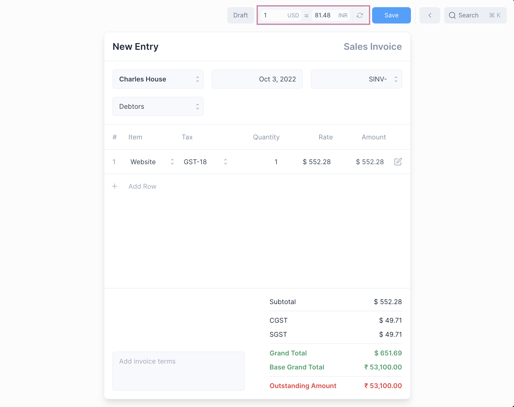
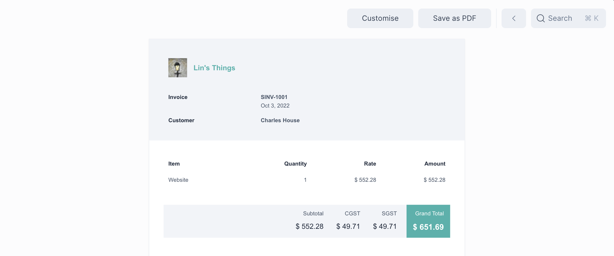
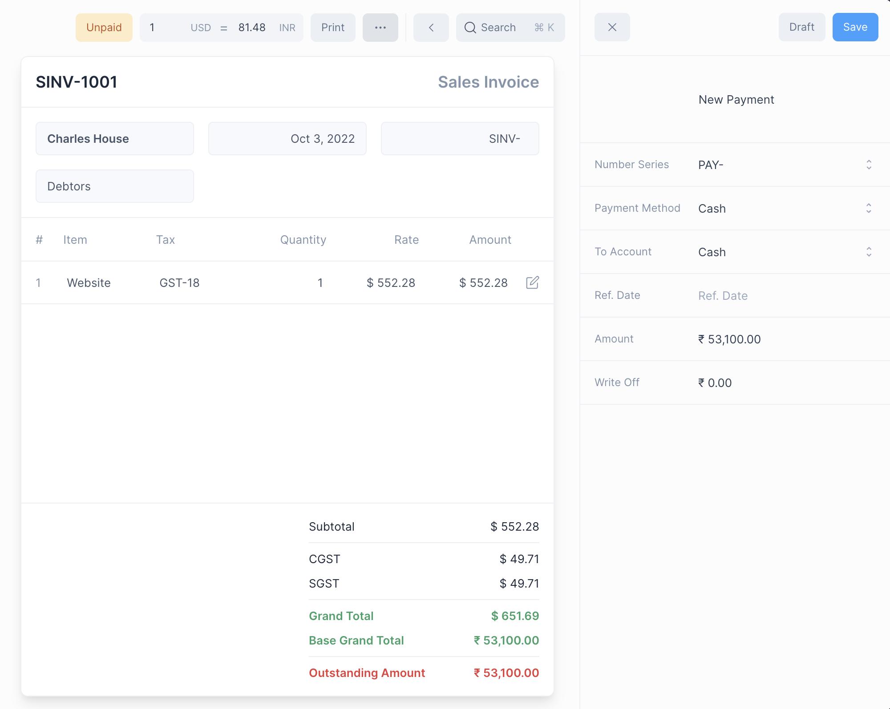
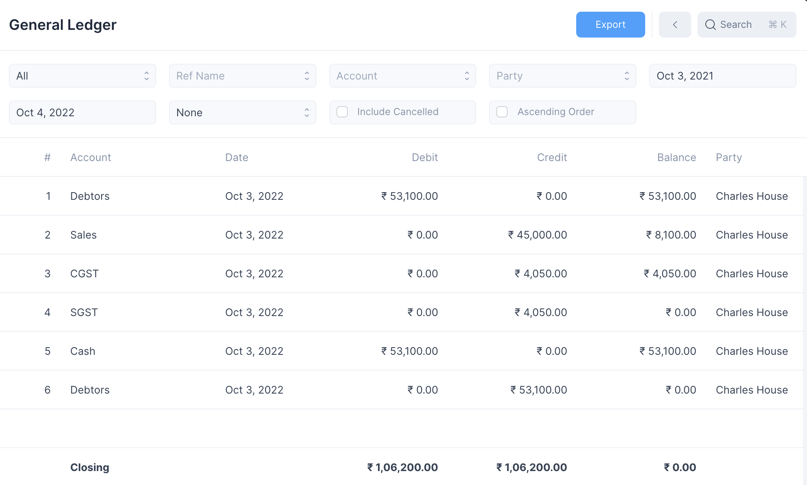
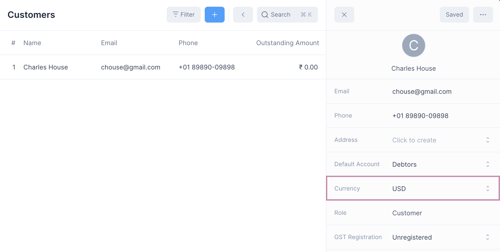
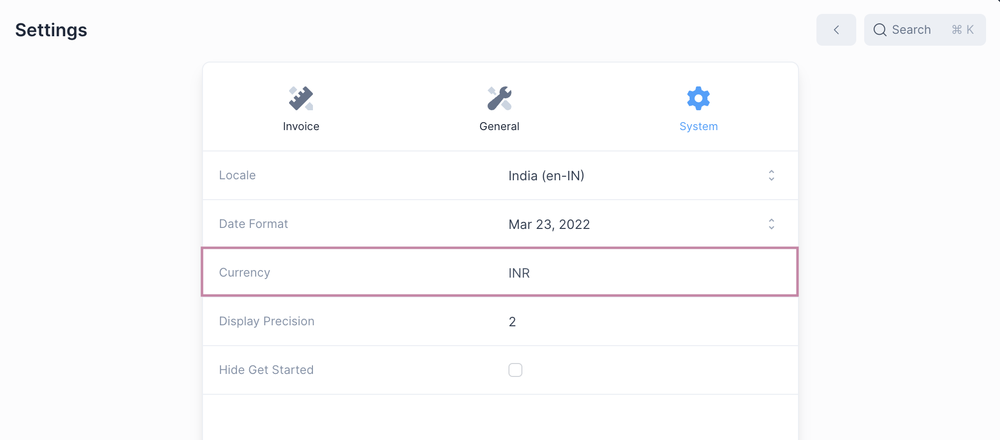

# Multi Currency Invoicing

Auditbooks allows you to create and print invoices in your customers currency.

::: tip Suppliers and Purchase Invoices The same applies procedure applies for creating a Multi Currency Purchase Invoice. Just set a different currency when creating a Supplier entry. :::

Creating a Multi Currency Invoice
---------------------------------

To enable a multi currency invoice you need to do two things:

1. Create a Customer entry with a [different currency](multi-currency-invoicing#customer-and-company-currency.md) from the company currency.
2. Select the Customer when creating a new invoice.

This will display the [exchange rate](multi-currency-invoicing#exchange-rate.md) widget.

  

::: info Fields using Company Currency The Base Grand Total and Outstanding Amounts are displayed in the company currency. :::

Printing
--------

After submitting, on clicking Print, the invoice can be printed in the customers currency.   

Payments
--------

Payments entries are made in the company currency. The exchange rate set when submitting the invoice is used to decide the amount to be paid.

  

On making the payment the Outstanding Amount will be updated accordingly, and any rounding differences will be balanced using the [Round Off Account](settings#general-settings.md).

Ledger Entries
--------------

Ledger Entries are created using the company currency. The exchange rate set when submitting the invoice is used to decide the recorded amounts.

  

Exchange Rate
-------------

When a multi currency invoice is made, the ledger entries are created in the company currency.

::: info Exchange Rate Company Currency = Customer Currency \u2a09 Exchange Rate :::

Customer and Company Currency
-----------------------------

Multi currency invoice is possible only if the two currencies are different from each other.

### Customer Currency

This is set when a [Customer](party.md) entry is created.

  

### Company Currency

This is set when [initializing](getting-started.md) a new Auditbooks instance

  
